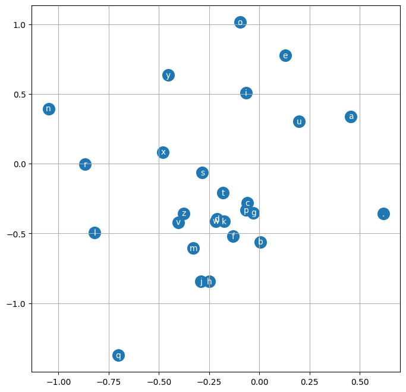
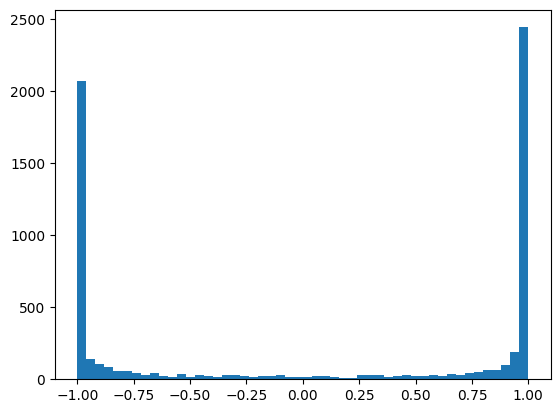
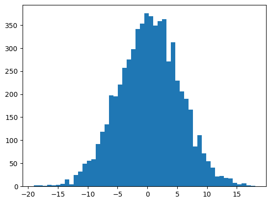
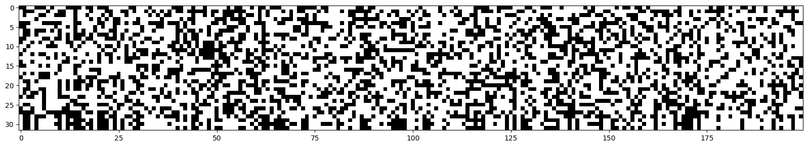
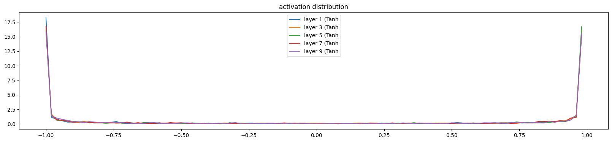
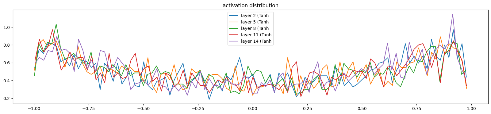
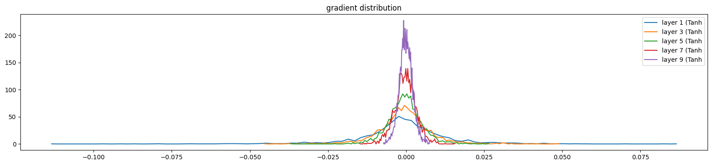
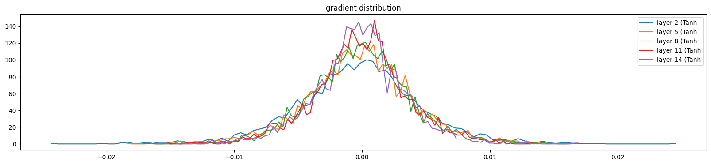
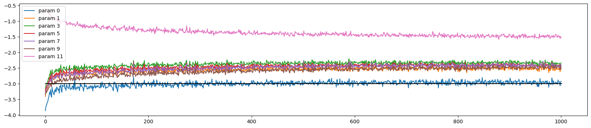
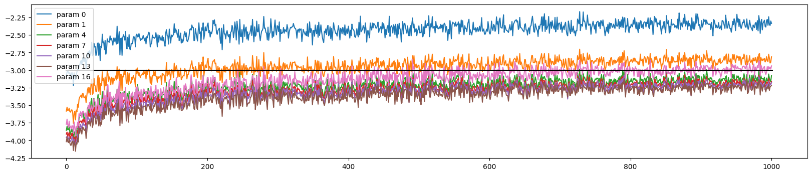

# ZeroToHero-experiment

This repo is from [ZeroToHero project](https://www.youtube.com/@AndrejKarpathy/playlists) by Andrej Karpathy.

I do some experiments for my own curiosity and to take away lessons.

### Lecture1 micro-grad

### Lecture2 bigram linear model

### Lecture3 MLP
- The goal is same as lecture 2 which is infer the next character given the context of name.
- Accept the MLP model from the [Bengio 2003 paper](https://www.jmlr.org/papers/volume3/bengio03a/bengio03a.pdf)
- Unlike lecture 2, use embedding to encode (one-hot enc has sparsity and othogonality)
- lecture2 was bigram, this one is 3-gram.
- pytorch has memory efficient api called `view` for reshaping tensors (read [pytorch internal blog post](http://blog.ezyang.com/2019/05/pytorch-internals/))
- `F.cross_entropy` does same operation of softmax and mean of Negative log likelihood. However it is more efficient in many ways than do seq of exp and norm and NLL.
  - forward and backward is much better in memory terms.
  - Numerically well behaved since it subtract the maximum value of the logits. 
- Find good initial learning rate with exponentially spaced and then apply first big step of that range of candidates later apply small one for preventing loss divergence 
- There are several ways to improve the model
  - Wider hidden layer dimension ([related blog post](https://lilianweng.github.io/posts/2022-09-08-ntk/))
  - Larger embedding dimension
  - Increase batch size
  - More context! (fundamental)

  

  

*Image of 2 dim Embedded characters. Quite amazed seeing that vowels are in the cluster. Letter y is more alike vowles which is make sense since the data is people name*

#### Ma Question  
1. what is the minimum loss we can get in theoretical way? not from empirical.
   It seems related to Entropy. Can we even calculate it?

### Lecture4 batchnorm
- we can get `expected initial loss` from the possible outcomes. For example, if our problem has 4 possible outcomes and we assume that all outcomes are equally likely, then -log(1/4) would be the expected loss at the first iteration.
- To achieve first quality, logits should be near zero in firts initialization. How?
  - Make last layer's parameter as low as can be by multiplying small number like 0.01
  - Do batchnorm, layernorm etc.
- This removes the warm up stage.(the first few iteration for squasing weights smaller and make sharply loss down like hockeystick.)
- There is also activation function problem. we used tanh squasing function.
The problem is that most of the outcome of tanh is 1 or -1. The reason is pre-activation data is too broad.

  

    <em>Histogram of the activation tanh outputs. too saturated</em>

  

    <em>Histogram of the pre-activation data. too broad</em>

  

    <em>If there is i th column which is all white, then i th neuron is dead one. White means that the output of tanh is in the flat region -1 or 1.</em>

- we want to make all the ouputs of layers roughly to be unit gaussian distributed throughout the whole NN. Adding on that, we also allow the distribution move around and scale by itself. We can make it by using batchnorm! [Batchnorm paper 2015](https://arxiv.org/abs/1502.03167)
- Batchnorm has also scale and shift parameters which can be learnt from backprop.
- Better use layernorm than batchnorm!
- **How can we say that training our model is going well?**
  - Visualize activation distribution(forward pass) and gradients distribution(backward pass) and see the consistency, stability throughout the layers except the last one.
  - See also the update magnitude(lr * grad) to its data ratio and see the stabiliy around 1e-3

| Meh   |   Good         |
|:-------------:|:-------------:|
|  |   |
|  |       |
|  |  |

### Lecture5 backprop